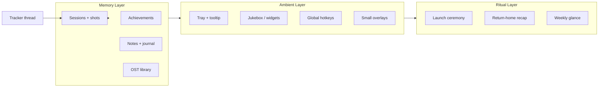

# GameTracker — "Always There" Feature Brainstorm (v2)

> **Context:** You already turned a personal habit — *"I always had a YouTube OST playlist open while gaming"* — into one of the app's best features. This document hunts for **more rituals like that**: things you already do adjacent to gaming, scattered across browser tabs, Spotify, Notes, Rainmeter, Discord, or memory, that could live in one tray-first home.
>
> **Research:** Codebase audit (June 2026), 8 web searches, competitor passes on UniPlaySong, Playnite wallpaper mode, CielChan/Mochi/Kovy2 desktop companions, deariary, GamrLog/MioLog, Sidekick AI, Rainmeter SMTC widgets, Backlog Shuffle/Grimoire mood picks, Steam Replay 2025, and the prior [feature brainstorm plan](gametracker_feature_brainstorm_de4df89d.plan.md).

---

## What changed since the last brainstorm (do not re-sell these)

The June 2025 plan listed achievements and theme music as *future* ideas. **They shipped.** GameTracker is now a much stronger "always there" app than that document assumed.

| Area                | Shipped since last plan                                                                                                                                                                                                |
| ------------------- | ---------------------------------------------------------------------------------------------------------------------------------------------------------------------------------------------------------------------- |
| **Music / OST**     | Global **jukebox** (`JukeboxFloater` on every page), per-game **SoundtrackPanel**, **ThemePlaylist** hub on Replay, per-detail **ThemePlayer**, OST backfill (`fetch_full_ost`, `build_ost_library`, `ost://progress`) |
| **Achievements**    | **Steam achievements** per game + Collection overview, badges on cards, sync via Steam login                                                                                                                           |
| **Launchers**       | Steam + GOG login/import/sync, local launcher catalog import                                                                                                                                                           |
| **Presence UI**     | **ProgressDock** (background jobs survive navigation), **AmbientShell**, marquee tiers (off/compact/full), splash + page transitions                                                                                   |
| **Memory capture**  | Auto-screenshots while focused, activity log (window titles/URLs), session day-buckets on GameDetail                                                                                                                   |
| **Discovery**       | **Suggested** tab (taste-matched picks), tag CRUD (rename/merge/delete), content audit/repair                                                                                                                          |
| **Beyond games**    | **Apps** tracking page, **System** live hardware monitor                                                                                                                                                               |
| **Reviews / media** | Steam + Metacritic review panels, trailers, embedded viewer, cached game stats                                                                                                                                         |

**Still open from the old plan (intentionally omitted here — see that doc):** Wrapped PNG export, `/wrapped` route, command palette, smart collections, Play Next, session tags, wellness depth, Discord RPC, Big Picture, cloud sync, etc.

---

## The design pattern behind the OST player

Your OST feature works because it checks four boxes:

1. **You already did it manually** — YouTube tab, same playlist, every session.
2. **The data was latent** — Every game already had theme URLs / playlist IDs from enrichment.
3. **It respects "always there"** — Floater persists across routes; tray app stays open anyway.
4. **It compounds the library** — One place for games *and* their soundtracks beats a disconnected playlist.

**Hunt for more features with this shape:**

| Your old habit                                 | Could become in Tracker                      |
| ---------------------------------------------- | -------------------------------------------- |
| Alt-tabbing to check Steam achievements        | ✅ Already built                              |
| Scrolling Steam wishlist for sales             | Price-watch tray nudge (ITAD-style, local)   |
| Checking "how long have I been on?"            | Tray tooltip + optional corner timer widget  |
| Rewatching game trailers before launching      | Auto-trailer on hover / launch countdown     |
| Keeping boss-strat notes in Notepad            | Game-linked scratchpad surfaced by hotkey    |
| "What did I play last Tuesday?"                | Memory Lane / On This Day card               |
| Leaving Discord RPC on for friends             | Optional rich presence (old plan)            |
| Rainmeter cover slideshow on second monitor    | Wallpaper / desk mode                        |
| Re-reading old session screenshots             | Screenshot scrapbook timeline                |
| Picking backlog by mood                        | Mood + time-budget shuffle (not AI-required) |
| Listening to game OST while *browsing* library | Browse-to-play music (UniPlaySong pattern)   |

---

## Pillar: Always There — what it should feel like

Not "more dashboard pages." **Ambient companionship:**

- Something is **playing**, **watching**, or **remembering** even when you're not looking at Tracker.
- Opening Tracker is optional; the tray / floater / hotkey gives you 80% of value.
- Features **reward accumulation** — the longer you use it, the richer your personal archive gets.
- **No account, no cloud** by default — your PC is the companion's memory.

---

## Category A — Music & sound (extend what you built)

*You have the hardest part done. These are deltas inspired by [UniPlaySong](https://github.com/aHuddini/UniPlaySong), Rainwave, and console UI patterns.*

| Feature                       | Why it's "always there"                                               | Notes                                                                |                                                                                 |                                                            |
| ----------------------------- | --------------------------------------------------------------------- | -------------------------------------------------------------------- | ------------------------------------------------------------------------------- | ---------------------------------------------------------- |
| **Browse-to-play**            | Hover/focus a game card → its theme plays (PS5/Xbox shelf feel)       | Yield to jukebox; respect `themeMuted`; UniPlaySong's killer feature |                                                                                 |                                                            |
| **Library radio modes**       | "Only games I played this week", "Backlog OSTs", "Random deep cut"    | Extend `ThemePlaylist` source filters                                |                                                                                 |                                                            |
|                               |                                                                       | **Now-playing on Windows**                                           | Publish jukebox state to **SMTC** so lock screen / volume OSD shows track + art | Rainmeter TIDAL widget pattern; makes music feel OS-native |
| **Completion fanfare**        | Short sting when you mark a game Completed                            | UniPlaySong has this; ties music to milestones                       |                                                                                 |                                                            |
| **Session-start sting**       | Optional 3s theme when a tracked game gains focus                     | Configurable; off by default                                         |                                                                                 |                                                            |
| **Fade on focus loss**        | Duck or pause OST when you alt-tab to work app                        | UPS "pause on focus loss"                                            |                                                                                 |                                                            |
| **Local file support**        | Drop MP3/FLAC/OGG into `media/ost/<gameId>/` — play alongside YouTube | Path to offline; no yt dependency                                    |                                                                                 |                                                            |
| **Chiptune formats**          | NSF/VGM/SPC via Rust chip crate or external player bridge             | Niche but magical for retro collectors                               |                                                                                 |                                                            |
| **Sleep timer**               | "Stop music in 45 min" from tray                                      | Cozy night gaming                                                    |                                                                                 |                                                            |
| **Crossfade between tracks**  | Jukebox already queues — add 2s overlap                               | Small polish, huge vibe                                              |                                                                                 |                                                            |
| **"Sounds like tonight"**     | Pick 5 tracks from games played today                                 | Ritual: end-of-session cooldown playlist                             |                                                                                 |                                                            |
| **Rainwave / OC Remix lane**  | Optional internet radio tab for when library OST runs dry             | Separate toggle from enrichment                                      |                                                                                 |                                                            |
| **Lyrics / composer credits** | Show composer name under track (IGDB/Steam metadata)                  | For the serious VGM listener                                         |                                                                                 |                                                            |
| **Export queue to M3U**       | Portable playlist file                                                | Backup / VLC / phone                                                 |                                                                                 |                                                            |
| **Discord "listening to"**    | Rich presence for OST track (opt-in)                                  | Friends see your vibe                                                |                                                                                 |                                                            |

**Quick win cluster:** browse-to-play + SMTC + completion fanfare = console-grade library feel in a week.

---

## Category B — Tray, hotkeys & glance (the biggest Always There gap)

| Feature                    | Personal ritual it replaces                    | Fit                                                                           |
| -------------------------- | ---------------------------------------------- | ----------------------------------------------------------------------------- |
| **Tray hover card**        | Opening full app to see today's time           | Rich tooltip: game, runtime/active, streak, goal %                            |
| **Tray left-click modes**  | —                                              | Click = last route OR mini glance overlay (user picks)                        |
| **Morning glance**         | Checking stats + calendar + weather separately | One overlay: yesterday, streak, next calendar event (ICS file)                |
| **Evening wind-down**      | "Should I stop?"                               | Soft summary: today's active time, breaks taken, tomorrow's first meeting     |
| **Global command palette** | Alt-tab hunting                                | `Ctrl+Shift+G`: launch, pause, play OST, log note, open game — *still #1 gap* |
| **Quick capture hotkey**   | Win+Shift+S then forget where file went        | Screenshot → attach to current game session                                   |
| **Clipboard ring**         | Copying friend codes repeatedly                | Last 10 snippets; game-linked pins                                            |
| **Media keys**             | —                                              | Play/pause jukebox from keyboard when floater focused                         |
| **Tray icon states**       | —                                              | Color/icon variants: playing, paused, idle, break due                         |
| **"Pin game for tonight"** | Mental bookmark                                | Tray submenu: 1-slot pin → launch from anywhere                               |
| **Countdown in tray**      | Phone timer for "one more run"                 | 15/30/60 min session cap with gentle end warning                              |
| **PowerToys bridge**       | —                                              | Expose palette commands to Windows Command Palette                            |

---

## Category C — Memory, diary & nostalgia ("the app remembers for you")

*Inspired by [deariary](https://deariary.com/) Steam integration, [GamrLog](https://gamrlog.com/), [MioLog](https://miolog.net/), [Game Calendar](https://reikakalseki.github.io/projects/calendar.html), screenshot managers.*

| Feature                        | Why it hits emotionally                         | Fit                                                       |
| ------------------------------ | ----------------------------------------------- | --------------------------------------------------------- |
| **On This Day**                | "A year ago you were playing…"                  | Query sessions by month/day; dashboard card               |
| **Memory Lane route**          | Scrollable life timeline of gaming eras         | Horizontal timeline + screenshot anchors                  |
| **Session diary line**         | One sentence after a long session               | Optional prompt on session end; stored on session row     |
| **Screenshot scrapbook**       | Auto-shots already exist — surface as album     | Best-of flag per shot; blur NSFW UI                       |
| **"Representative moment"**    | Pick one screenshot as era cover                | Game Calendar `memorable` flag pattern                    |
| **Achievement diary**          | "Unlocked X on this date" narrative             | Steam sync + local journal merge                          |
| **Revisit completed games**    | "It's been 2 years since you finished Portal 2" | Nostalgia nudge; links to OST                             |
| **Play anniversary**           | First session N years ago                       | Derived from `sessions` min date                          |
| **Weekly paragraph (local)**   | Auto summary without cloud LLM                  | Template: "You played 4 games, 12h, mostly RPGs at night" |
| **Export memory bundle**       | ZIP: shots + stats + notes for a year           | Share with future self                                    |
| **Gaming calendar wallpaper**  | Gantt-style poster of your gaming life          | Export PNG for wall / second monitor                      |
| **Voice memo attach**          | Whistle boss pattern into mic                   | `media/voice/<sessionId>.webm` — heavy but personal       |
| **"First time back" ceremony** | Returning to game after 6+ months               | Special card + optional theme auto-play                   |

**Non-gaming tangent (might still land in Tracker):** same "On This Day" engine could show *any* milestone you log (finished a course, started a job) if you add a generic `life_events` table — optional scope creep, but the OST story shows personal rituals belong here.

---

## Category D — Launch & return rituals (micro-ceremonies)

| Feature                       | Moment                           | Vibe                                             |
| ----------------------------- | -------------------------------- | ------------------------------------------------ |
| **Launch countdown**          | 3…2…1 before `launch_game`       | Optional trailer frame + theme swell             |
| **"Welcome back"**            | First focus after 7+ days away   | "Last time: 4h, boss X" from notes               |
| **Session end card**          | Game process closes              | Runtime/active, shots taken, next break          |
| **Backlog shuffle animation** | Can't pick a game                | Slot machine from filtered backlog — fun, not AI |
| **Mood picker**               | "Cozy / sweaty / story / 30 min" | Filters library + OST radio + Play Next          |
| **Pin & launch tonight**      | Found something at work          | Tray holds it until evening                      |
| **Friday night mode**         | Auto-relax settings Fri 6pm      | Softer marquees, OST on, wellness off            |
| **Completion ceremony**       | Mark Completed                   | Fanfare + confetti + add to Collection highlight |
| **New game ceremony**         | First session ever               | "First steps" badge locally                      |

---

## Category E — Ambient visual presence (desk as gaming shrine)

*Inspired by Playnite wallpaper mode, Kovy2, your marquee system, Rainmeter.*

| Feature                             | What it does                                                       | Fit                                             |
| ----------------------------------- | ------------------------------------------------------------------ | ----------------------------------------------- |
| **Desk mode**                       | Transparent always-on-bottom window: drifting covers + now-playing | Playnite + AHK pattern; Tracker already has art |
| **Second-monitor widget**           | Portrait cover + timer + OST visualizer                            | Small Tauri window                              |
| **Cover slideshow screensaver**     | When idle 10+ min, float your library                              | Uses existing `CoverMarquee`                    |
| **Visualizer on floater**           | Audio-reactive bars on jukebox                                     | Web Audio API; UniPlaySong has this             |
| **Seasonal desk themes**            | Winter = cool palette, Halloween = orange                          | Extends accent system                           |
| **"Currently vibing" desk caption** | Text overlay: game + track                                         | For streamers / aesthetic setups                |
| **Live streak flame**               | Dashboard streak as desk ornament                                  | Gamification without XP grind                   |
| **Photo mode**                      | Hide UI, pure art + music                                          | Screenshot your own setup                       |

---

## Category F — Achievements & completion (extend what you built)

| Feature                        | Beyond current Steam panel                    | Fit                          |
| ------------------------------ | --------------------------------------------- | ---------------------------- |
| **Achievement hunt mode**      | Filter library to "< 5 achievements left"     | Steam cache you already have |
| **Rare achievement glow**      | Highlight < 5% unlock in list                 | Steam global percentages     |
| **Next achievable suggestion** | "Closest to 100%"                             | Sort by % complete           |
| **Non-Steam manual trophies**  | Finished DLC, self-imposed challenges         | JSON on game row             |
| **Platinum shelf**             | 100% games get Collection subsection          | Trophy case                  |
| **Achievement + session link** | "Got this during a 6h session"                | Timestamp correlation        |
| **Weekly unlock digest**       | Tray toast Sunday: "4 achievements this week" | Steam diff sync              |
| **GOG achievement parity**     | When GOG sync matures                         | Same UI components           |

---

## Category G — Companion & personality (optional delight)

*Inspired by Mochi, CielChan, Kovy2, Sidekick AI — **default off**, privacy-first.*

| Feature                     | Scope                                              | Warning                        |
| --------------------------- | -------------------------------------------------- | ------------------------------ |
| **Minimal desk mascot**     | Small Lottie sprite reacting to playing/idle/music | No screen reading              |
| **Mood lines**              | "3h tonight — hydrate?" from rules, not LLM        | Wellness crossover             |
| **Cat on the floater**      | Sits on jukebox corner when playing OST            | Pure charm                     |
| **Local LLM weekly letter** | "Dear player, this week you…"                      | Opt-in Ollama                  |
| **Voice greeting**          | TTS "Welcome back" on launch                       | Very optional                  |
| **Sidekick-style overlay**  | In-game tips via vision                            | **Defer** — Game Bar territory |

**Strong opinion:** A non-AI mascot tied to *your real stats* beats a chatbot that pretends to care.

---

## Category H — Discovery & "what tonight?" (lightweight, not Grimoire)

| Feature                           | Avoids                | Fit                                         |
| --------------------------------- | --------------------- | ------------------------------------------- |
| **Mood + minutes shuffle**        | Cloud AI              | Local filter: mood tag + HLTB + time budget |
| **"Continue where you left off"** | —                     | Last 3 touched games with session recency   |
| **Rotation pool**                 | Same game every night | Mark 5–10 games as "in rotation"            |
| **Anti-backlog guilt**            | Shame                 | "Gentle pick": shortest HLTB in backlog     |
| **Pin from Suggested**            | —                     | One-click pin to tray                       |
| **Co-op filter**                  | —                     | Tag + "friends available" manual flag       |
| **Weather-aware suggestion**      | Silly but fun         | Rain → cozy tag boost (local weather API)   |

---

## Category I — Streaming & sharing presence

| Feature                         | Always-there angle                                       |
| ------------------------------- | -------------------------------------------------------- |
| **OBS scene note**              | Tray copies "Now playing: X (2h14m)" for stream title    |
| **Now-playing overlay URL**     | Local `http://127.0.0.1:PORT/now` for OBS browser source |
| **Clip marker hotkey**          | Drop timestamp marker into session log for later         |
| **Stream-safe jukebox**         | Option to mute copyrighted OST when OBS detects capture  |
| **Weekly stream schedule card** | If you stream Thu/Sat, show prep checklist               |

---

## Category J — Cross-app & life-adjacent (tangents you might steal)

*Not all belong in Tracker. Included because you asked for ideas "even things not related to the app."*

| Idea                              | Why you might care            | Tracker angle                                      |
| --------------------------------- | ----------------------------- | -------------------------------------------------- |
| **Automatic gaming diary**        | deariary pattern              | Morning export: sessions + achievements → markdown |
| **Spotify / Last.fm scrobble**    | Music life parallel           | "Also listened while gaming" correlation           |
| **Reading log**                   | Same "one place for passions" | Separate module or CSV import only                 |
| **Anime episode tracker**         | Evening ritual overlap        | Too far unless you want "media hub"                |
| **Work focus correlation**        | "Gamed more on WFH days"      | Apps page already exists — cross-chart             |
| **Meal break reminder**           | Gaming hyperfocus             | Tray: "You haven't left desk in 4h"                |
| **LAN party mode**                | Friends on same network       | Local mDNS "who's playing what" — no cloud         |
| **Game night lobby**              | Discord replacement lite      | Shared JSON file in Dropbox folder                 |
| **Physical shelf photo**          | Collector aesthetic           | OCR spine → wishlist entry — wild                  |
| **RetroPie / emulation shelf**    | Same library mental model     | Emulator launch integration                        |
| **Twitch VOD timestamp**          | Link stream to game session   | URL field on session                               |
| **Keyboard sound ASMR lane**      | Cozy typing + OST             | Way out there                                      |
| **Plant watering tied to breaks** | Wellness gamification         | "Take break → water plant" virtual pet             |
| **Yearly printed poster**         | Wrapped physical artifact     | Export print-ready PDF                             |

---

## Category K — Hardware & desk ecosystem

| Feature                        | Fit                                          |
| ------------------------------ | -------------------------------------------- |
| **Controller battery in tray** | XInput poll when game running                |
| **Headset battery**            | If Windows exposes it                        |
| **GPU temp tray warning**      | When `/system` sees throttle                 |
| **"Can I run it?"**            | Compare session perf to current live specs   |
| **Desk LED integration**       | OpenRGB: accent color = current game palette |
| **Stream deck profile**        | Hotkey export JSON                           |

---

## Category L — Privacy-first "life OS" boundaries

Things popular in 2025–2026 companion apps that **conflict** with Tracker's soul:

| Trend                                                | Verdict                              |
| ---------------------------------------------------- | ------------------------------------ |
| Screenshot-every-5-seconds diary (Diaroo, Screencap) | Too invasive for gaming audience     |
| Full desktop agent (Glitch)                          | Different product                    |
| Cloud-required AI companion                          | Breaks local-first                   |
| Mandatory always-on-top overlay                      | Users hate default overlays          |
| Social feed                                          | Playnite users explicitly avoid this |

**Tracker's edge:** You already have *consented* signals — process focus, idle, optional auto-shots, activity log titles. Build memory on that, not surveillance.

---

## OST feature roadmap (concrete next steps)

If you want to **double down on the music story** (your proven winner):

### Tier 1 — Console feel (3–5 days)

1. Browse-to-play on Library hover/focus (with debounce + mute respect)
2. SMTC now-playing metadata from jukebox
3. Completion fanfare on status → Completed
4. "Sounds like tonight" end-of-day queue from today's games

### Tier 2 — Ritual depth (1 week)

1. Session-start optional theme sting
2. Fade/pause on alt-tab to non-game
3. Sleep timer in floater + tray
4. Local `media/ost/` folder playback

### Tier 3 — Shrine mode (1–2 weeks)

1. Desk mode window (always-on-bottom art + music)
2. Audio visualizer on floater
3. M3U export + Rainwave optional tab

---

## Always There priority matrix (new work only)

| Priority | Feature                            | Why now                                                     |
| -------- | ---------------------------------- | ----------------------------------------------------------- |
| **P0**   | Global command palette             | Single biggest daily-use gap vs tray-first vision           |
| **P0**   | Tray glance card                   | You already live in the tray — tooltip is underpowered      |
| **P1**   | Browse-to-play OST                 | Finishes the UniPlaySong fantasy with your existing jukebox |
| **P1**   | On This Day / Memory Lane          | Emotional stickiness; uses data you already collect         |
| **P1**   | SMTC now-playing                   | Makes jukebox feel native to Windows                        |
| **P2**   | Morning/evening glance             | Extends tray without new pages                              |
| **P2**   | Session end card + diary line      | Closes the loop when game closes                            |
| **P2**   | Achievement hunt filters           | Steam work already done — pure UI                           |
| **P2**   | Desk mode / second-monitor widget  | Visual "always there" like your old YouTube tab             |
| **P3**   | Mood shuffle + pin tonight         | Play Next lite without AI                                   |
| **P3**   | Local mascot / completion ceremony | Delight layer                                               |
| **P3**   | OBS now-playing URL                | Streamer niche, low effort                                  |

---

## Ideas explicitly deferred to the *first* brainstorm doc

Do not duplicate planning effort — see [gametracker_feature_brainstorm_de4df89d.plan.md](gametracker_feature_brainstorm_de4df89d.plan.md) for:

- Shareable Wrapped PNG + `/wrapped` route
- Smart collections / saved filters
- Play Next time-budget engine
- Session tags
- Wellness depth (20-20-20, time wallet, macro breaks)
- Discord RPC (listed there; also mentioned here as OST variant only)
- Steam playtime sync, playthroughs, perf correlation, Big Picture, cloud sync, PowerToys extension, local REST API

**Synergy:** Wrapped export + Memory Lane + OST "year in music" = a killer **2026 recap trilogy**.

---

## Suggested identity refresh (5 pillars, June 2026)

1. **Know yourself** — analytics, Wrapped, achievements, apps crossover
2. **Play smarter** — suggestions, HLTB, mood shuffle, pin tonight
3. **Stay healthy** — breaks, goals, session end awareness
4. **Always there** — tray, jukebox, glance, palette, desk presence, memory ← *this doc*
5. **Yours forever** — local OST files, exports, no account

**Tagline candidate:** *"Your games. Your hours. Your soundtrack. Always there."*

---

## Research links (June 2026)

| Source                                                                                                                          | Takeaway                                                            |
| ------------------------------------------------------------------------------------------------------------------------------- | ------------------------------------------------------------------- |
| [UniPlaySong](https://github.com/aHuddini/UniPlaySong)                                                                          | Browse-to-play, fanfare, chiptune, reverb, SMTC-adjacent media keys |
| [Playnite wallpaper mode](https://github.com/tedhinklater/playnite-wallpaper)                                                   | Always-on-bottom library art                                        |
| [Rainmeter SMTC widget](https://github.com/tobiasgbg/rainmeter-tidal-bar-display)                                               | OS now-playing integration pattern                                  |
| [CielChan](https://phasma.ai/)                                                                                                  | Ambient soundscapes + window focus awareness                        |
| [Mochi / Kovy2](https://github.com/NatBrian/mochi-llm-pet)                                                                      | Desk presence without being a launcher                              |
| [deariary Steam blog](https://blog.deariary.com/posts/2026-04-25-steam-integration-deep-dive)                                   | Sessions → diary narrative                                          |
| [GamrLog / MioLog](https://gamrlog.com/)                                                                                        | Journal + mood + taste DNA                                          |
| [Backlog Shuffle / Grimoire](https://backlogshuffle.com/)                                                                       | Mood + schedule picks                                               |
| [Steam Replay 2025](https://www.engadget.com/gaming/pc/steam-replay-2025-is-here-to-recap-your-pc-gaming-habits-205430951.html) | Shareable recap cultural expectation                                |
| [Sidekick AI](https://store.steampowered.com/app/3992240/Sidekick_AI/)                                                          | Presence companion positioning (in-game — avoid)                    |

---

## If you only build three things next

1. **Command palette** — launch, pause, music, notes from anywhere.
2. **Browse-to-play + SMTC** — library feels alive like your old YouTube tab, but integrated.
3. **On This Day card** — "One year ago you played Hades for 4 hours" on dashboard open.

That trio makes Tracker feel less like an app you *open* and more like something that was *already with you*.