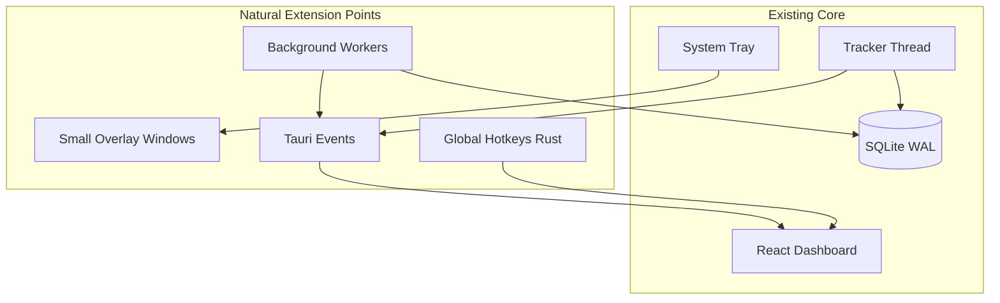

# GameTracker Feature Brainstorm Plan

Research drew from **3 parallel codebase/internet agents**, **6 web searches**, and competitor analysis of Playnite, GOG Galaxy, Steam Replay, GameActivity, ActivityWatch, Vital/YourFocus, Sentinel Signal, KTOMG, ZGameLib, Xbox Game Bar, and 2025–2026 local-first productivity dashboards (FlowDesk, NeumanOS, PrismOS).

---

## What You Already Have (baseline — don't re-sell these)

GameTracker is already far beyond a simple playtime tracker. Existing capabilities to build *on top of*:

| Area | Already shipped |
|------|-----------------|
| **Tracking** | Runtime + active time, idle detection, session merge, focus spans, activity log (window titles/URLs), apps + games |
| **Library** | Multi-view library, tags + tag analytics, HLTB, suggestions, CSV import, drag-drop, scan/detect |
| **Analytics** | Heatmap, streaks, hour-of-day/weekday, timeline, dashboard sparkline, Collection scatter/pies, partial Wrapped in Collection |
| **Hardware** | Live CPU/GPU/RAM/disk/temps + history on `/system` |
| **Wellness** | Daily goal minutes, break reminders (settings + tracker) |
| **Media** | Auto-screenshots, theme music, trailers, embedded reviews |
| **Infra** | Tray-first, autostart, backup/restore, session export, silent updater, online enrichment toggle |

**Documented gaps** (from [AGENTS.md](AGENTS.md) + codebase): shareable Wrapped PNG export, dedicated `/wrapped` route, full tag CRUD, better cover matching/IGDB, jumbo icons, broader `steam_app_id` on detection.

---

## Architecture fit (how new features should plug in)

**Low-friction additions**: new SQLite tables, new settings keys, new routes, tray menu items, Tauri overlay windows, global hotkeys (`RegisterHotKey` in Rust).

**High-friction additions**: in-game overlay competing with Game Bar, full launcher replacement, cloud sync, passive screenshot OCR, full Raycast clone.

---

## Category 1 — Gaming & Library (tracker-adjacent)

Ideas users repeatedly request across [KTOMG](https://ktomg.uservoice.com/), [Playnite issues](https://github.com/JosefNemec/Playnite/issues), [ZGameLib](https://zsync.eu/zgamelib/):

| Feature | Why it's cool | Fit |
|---------|---------------|-----|
| **Smart collections / saved filters** | "Backlog under 20h HLTB + not played in 90 days" | Dynamic SQL views; Library already has filters |
| **Duplicate / series grouping** | Same game on Steam + Epic = one card | New `series_id` or parent-child link |
| **Play Next picker** | Time-budget-aware ("I have 90 min tonight") | ZGameLib pattern; you have HLTB + suggestions |
| **Per-game incognito mode** | Launch without tracking (Playnite #3716) | Per-game `tracking_enabled` flag |
| **Manual session timer** | Phone stopwatch replacement (KTOMG top request) | Start/stop button → writes session row |
| **Progress checklists** | "90% complete" beyond status enum | JSON checklist on game row (KTOMG Caldera update) |
| **Multiple playthroughs** | NG+, speedrun, co-op run | `playthroughs` table linked to game |
| **Steam playtime sync** | Import official hours (never decrease local) | ZGameLib pattern; Steam Web API key |
| **Subscription awareness** | Game Pass vs owned | Registry/launcher metadata |
| **Ranked tier lists** | S/A/B/C personal rankings | Sortable list view + export |
| **Launch from anywhere** | `steam://`, Epic URI, direct exe | Palette + Game Detail |
| **Double-buy prevention** | "You own this on GOG already" | Cross-store duplicate detection |
| **Barcode scan (mobile companion)** | Physical collectors | Future mobile app; out of scope for desktop-only |
| **Achievement tracking** | % complete per playthrough | Steam API or manual; KTOMG roadmap item |

---

## Category 2 — Analytics, Wrapped & Shareables

Inspired by [Steam Replay 2025](https://www.engadget.com/gaming/pc/steam-replay-2025-is-here-to-recap-your-pc-gaming-habits-205430951.html), Shelf, GameTrack:

| Feature | Why it's cool | Fit |
|---------|---------------|-----|
| **Dedicated Wrapped route** | Full-screen cinematic recap | `InsightsContent` data exists; needs route + polish |
| **Shareable stat-card PNG** | Social flex without screenshots | Canvas/SVG export (AGENTS.md roadmap) |
| **Monthly recap email/file** | "Your March in gaming" auto-generated | Local HTML/PDF; no email server needed |
| **Year-over-year compare** | "28 games vs 19 last year" | Steam Replay pattern |
| **Community percentile** | "Longer streak than 80% of users" | Needs anonymized aggregate OR local heuristic |
| **Gaming DNA / personality type** | "Night owl roguelike main" | Fun rules engine on tags + hour-of-day |
| **Genre/platform spider chart** | Visual identity card | Recharts; tag/genre data |
| **Input method breakdown** | KB+M vs controller % | Requires input device detection (Win32) |
| **Completion velocity** | Games finished per month trend | Collection + completion dates |
| **Session tags** | "ranked", "with friends", "chill" | Filter stats later; lightweight enum on session |
| **Auto-generated weekly paragraph** | Local Ollama recap of your week | Opt-in; respects `online_metadata_enabled` spirit |
| **Activity calendar export** | iCal of gaming sessions | For people who use calendar apps |
| **Public profile page (local)** | `file://` or bundled static export | Privacy-first share bundle |

---

## Category 3 — Productivity & Everyday Tray Utilities

From tray-app research (focusdot, FlowDesk, Raycast-on-Windows, PowerToys patterns) — **complement gaming without becoming a second OS**:

| Feature | Why it's cool | Fit |
|---------|---------------|-----|
| **Morning glance / daily briefing** | One tray click: yesterday playtime, streak, weather, next calendar event | New overlay route; ICS read-only |
| **Global command palette** (`Ctrl+Shift+G`) | Launch game, pause tracking, log habit, open Wrapped | High everyday value; game-centric scope |
| **Tray Pomodoro / focus timer** | Icon color = focus/break/idle (focusdot pattern) | Separate `focus_sessions` table; unified timeline |
| **Quick scratchpad** | Global hotkey notes: boss strats, seed numbers | `notes` table linked to `game_id` |
| **Pinned text snippets** | Gamertags, Discord invites, LFG templates | Tiny clipboard ring (25 items, RAM option) |
| **3–7 daily habits** | "Stretch", "touch grass", "no gaming past 11pm" | Shared heatmap visual language |
| **Countdown widgets** | Game release, exam, vacation | Settings + dashboard card |
| **Year/week progress bar** | "12% of 2026 gone" | Zero-backend motivational widget |
| **Now playing unified card** | Game art + session timer + Spotify SMTC | Windows System Media Transport Controls |
| **PowerToys Command Palette extension** | Ship GameTracker commands into existing launcher | [`cmdpal-rs`](https://github.com/microsoft/PowerToys) — low competition |
| **Quick todo capture** | One-line task with optional due date | Etch pattern; don't build full PM |
| **Obsidian export** | Game journal → markdown vault | Matches local-first audience |

---

## Category 4 — Wellness & Healthy Gaming

From [Vital](https://www.overwolf.com/app/vital-vital), [YourFocus](https://store.steampowered.com/app/4037900/YourFocus/), [Sentinel Signal](https://www.sentinelsignal.com/) — **your differentiator: you already know which game is running and runtime vs active**:

| Feature | Why it's cool | Fit |
|---------|---------------|-----|
| **Session-aware 20-20-20 breaks** | Only nudge during focused gaming | Extends existing `break_reminder_minutes` |
| **Macro breaks (90 min)** | 5–10 min stretch with postpone limits | Overlay window; per-game mute |
| **Time wallet / soft weekly budget** | Bank unused minutes for weekend | Sentinel Signal; separate from daily goal |
| **Graceful session end warnings** | "15 min left" before hard stop | Audio + toast; optional not kill-process |
| **Post-session wellness report** | "3h, 2 breaks taken, 4 skipped" | Session summary card |
| **Hydration tracker** | +250ml quick log from tray | Simple counter; not a health app |
| **Posture / stretch micro-prompts** | GIF or text guides | YourFocus exercises |
| **Audio exposure warning** | Sustained high volume nudge | Win32 volume read |
| **Non-gaming streak** | Days under 30 min playtime | Wellness framing without nagging |
| **Gaming Pomodoro** | Focus intervals for ranked grind | Bridges Category 3 + 4 |
| **Per-game break profiles** | No breaks during cutscene-heavy RPG | User override per game |

*Note: Basic break reminders + daily goals already exist — this tier is about **depth and session intelligence**, not re-adding the same toggle.*

---

## Category 5 — Hardware, Performance & In-Game Presence

From GameActivity plugin, [Xbox Game Bar](https://developer.microsoft.com/en-us/games/products/game-bar/), ZenDeck:

| Feature | Why it's cool | Fit |
|---------|---------------|-----|
| **Per-session perf snapshot** | FPS/CPU/GPU at session end | Extend `/system` monitoring into session row |
| **Perf overlay (optional)** | Pin FPS chart during game | Small always-on-top Tauri window |
| **Per-game perf history** | "Cyberpunk averages 45 FPS" | Query sessions + system samples |
| **Quick perf search** | "Games where I got 60+ FPS" | GameActivity pattern |
| **LibreHardwareMonitor integration** | Deeper sensor data | Rust sidecar or read shared memory |
| **Network ping widget** | Competitive gamers | ICMP from worker thread |
| **Clip buffer / replay** | Save last 30s (Game Bar style) | Heavy; OBS/ShadowPlay already exist |
| **Controller battery indicator** | Handheld/couch users | XInput read |
| **Session hardware report card** | Export "my rig ran this game at X" | Shareable PNG tie-in |

*Scope guard: Game Bar owns in-game overlay. GameTracker's edge is **correlating perf with your library and sessions**, not replacing Win+G.*

---

## Category 6 — Social & Community (opt-in only)

Playnite users explicitly trade social for privacy — **all social must be opt-in and local-first first**:

| Feature | Why it's cool | Fit |
|---------|---------------|-----|
| **Discord Rich Presence** | Show game + session state | YourFocus does this; small Rust crate |
| **Export share bundle** | ZIP: Wrapped PNG + stats JSON | No server needed |
| **Friend activity (manual)** | "Alex is playing X" via shared file | Not real-time; privacy-safe |
| **Looking-for-group note** | Copy LFG template to clipboard | Snippet + palette |
| **Public tier list export** | Image for Reddit/Twitter | Wrapped export variant |
| **Local leaderboard vs past self** | "Beat your January hours" | No multiplayer needed |
| **Steam profile showcase sync** | Export replay-compatible image | Manual upload |

*Skip: full social network, activity feeds, cloud friends — different product.*

---

## Category 7 — Data, Sync & Power-User Tools

| Feature | Why it's cool | Fit |
|---------|---------------|-----|
| **Scheduled auto-backup** | Weekly zip to chosen folder | Playnite #912 |
| **Optional encrypted cloud sync** | PC ↔ laptop via WebDAV/S3 | E2E optional; Playnite #108 demand |
| **Import from Playnite/GOG export** | Migration path | One-time JSON importer |
| **Full activity export API** | Local REST/WebSocket for streamers | Pomotroid pattern |
| **MCP read-only endpoint** | "What did I play last week?" for Cursor/Claude | Fits developer audience |
| **Blocklist for apps** | Exclude banking/password managers | If adding non-game analytics |
| **Opt-in desktop-wide analytics** | Top non-game apps today | ActivityWatch-lite; separate toggle |
| **Data audit dashboard** | Orphan sessions, duplicate games | Extend Settings content audit |
| **Git-style changelog of library** | "Added 3 games this week" | Activity log table |

---

## Category 8 — Gamification & Identity

| Feature | Why it's cool | Fit |
|---------|---------------|-----|
| **Profile level / XP** | XP for sessions, completions, streaks | PlayTracker pattern |
| **Achievement badges (local)** | "100h in one game", "7-day streak" | Unlock notifications |
| **Seasonal challenges** | "Clear 3 backlog games this month" | Challenge table + progress |
| **GOTY picker** | Year-end ranked top 10 | Collection page extension |
| **Backlog roulette** | Spin wheel to pick next game | ZGameLib has this; fun micro-feature |
| **Collection completion %** | "72% of your 2020 backlog done" | Stats query |
| **Habit ↔ gaming correlation** | "On stretch days, sessions 20% shorter" | Unique crossover if habits added |

---

## Category 9 — AI & Smart Assistants (careful scope)

From Gaming Copilot, PrismOS, OpenLoaf — **local-first or explicit opt-in only**:

| Feature | Why it's cool | Fit |
|---------|---------------|-----|
| **"What should I play?" chat** | Natural language over your library | Local Ollama + SQLite context |
| **Weekly recap narrative** | One paragraph about your gaming week | Lightweight prompt |
| **Backlog prioritization AI** | Rank by mood, time, HLTB | Rules + optional LLM |
| **Cover/name fuzzy validation** | "Steam result doesn't match query" | AGENTS.md roadmap item |
| **Session summary from activity log** | "Mostly in menus" from window titles | No screenshots needed |
| **Semantic search over notes** | Find "that Elden Ring strat" | Local embeddings; heavy |

*Skip: cloud AI requiring account, screenshot-grounded copilot (privacy + Game Bar overlap).*

---

## Category 10 — UX & Shell Polish

| Feature | Why it's cool | Fit |
|---------|---------------|-----|
| **Big Picture / controller mode** | Couch + handheld | Fullscreen route; large tiles |
| **Custom themes / accent packs** | Premium feel | Extend existing accent system |
| **Configurable dashboard widgets** | Drag-reorder cards | Partially exists via widget toggles |
| **Mini desktop widget** | Rainmeter-style always-on-top | Separate transparent window |
| **Startup view picker** | Land on Library vs Dashboard | Already in local prefs |
| **Fullscreen break overlay** | Vital-style in-game reminder | Tauri overlay; auto-hide when not gaming |
| **Sound pack for notifications** | Session start/end chimes | Settings |
| **Multi-monitor aware tray tooltip** | Show game on which display | Win32 |

---

## Priority tiers (recommended sequencing)

### Tier A — High impact, fits architecture, users ask for it
1. **Shareable Wrapped / stat-card PNG export** — completes existing partial work; Steam Replay made this table stakes
2. **Dedicated `/wrapped` route** with cinematic presentation
3. **Global command palette** — games + pause + habits; everyday utility
4. **Smart collections / saved filters** — power-user library management
5. **Play Next / time-budget picker** — HLTB + backlog + "90 min tonight"
6. **Session tags** ("ranked", "co-op") — unlocks better analytics later
7. **Full tag CRUD** — rename/delete/merge (partial today)

### Tier B — Strong differentiation, moderate effort
8. **Session-aware wellness depth** — 20-20-20, macro breaks, post-session report (extend existing break system)
9. **Time wallet / soft weekly budget** — Sentinel Signal pattern
10. **Morning glance briefing** — tray overlay combining stats + optional ICS/weather
11. **Tray Pomodoro** — unified timeline with game sessions
12. **Per-game incognito tracking**
13. **Manual session timer** — KTOMG top request
14. **3–5 daily habits + shared heatmap**
15. **Quick scratchpad + game-linked notes**
16. **Discord Rich Presence** — low effort, high delight

### Tier C — Valuable but larger scope
17. **Progress checklists / multiple playthroughs**
18. **Steam playtime sync**
19. **Per-session hardware perf correlation**
20. **Duplicate/series grouping across stores**
21. **Scheduled auto-backup**
22. **PowerToys Command Palette extension**
23. **Local REST/WebSocket API** for overlays/streamers
24. **Big Picture / controller mode**

### Tier D — Cool but risky / scope creep (defer or never)
- Full in-game overlay competing with Game Bar
- Cloud-required social network
- Screenshot-based activity tracking (Hindsight-style)
- Full Raycast/PowerToys replacement
- Mobile companion app (unless deliberate platform expansion)
- Achievement hunting platform (PlayStation/Xbox API hell)
- "Life OS" (email, calendar, kanban, finance in one app)

---

## What NOT to build (lessons from research)

| Trap | Why |
|------|-----|
| Replace PowerToys/Raycast | Users already have them; integrate instead |
| Mandatory cloud account | 2025–2026 trend is local-first (ActivityWatch, Playnite) |
| Default fullscreen overlays | Vital users complain; default to toasts |
| Passive screenshot OCR | High privacy friction for gaming audience |
| 8-module "life OS" | Different product (NeumanOS, OpenLoaf) |

---

## Quick wins vs flagship features

**Quick wins (1–3 days each)**
- Backlog roulette, year progress bar, countdown widget, Discord Rich Presence, session tags, ranked tier view, export share bundle ZIP

**Flagship features (1–2 weeks each)**
- Wrapped route + PNG export, command palette, Play Next engine, wellness overlay depth, habits system, Steam playtime sync

**Platform bets (multi-week)**
- Big Picture mode, optional cloud sync, perf-per-session pipeline, PowerToys extension, local LLM weekly recap

---

## Suggested "GameTracker 2.0" identity pillars

If you want a coherent product direction beyond feature soup:

1. **Know yourself** — best-in-class local analytics (runtime + active + Wrapped + shareables)
2. **Play smarter** — HLTB-aware planning, Play Next, smart collections
3. **Stay healthy** — session-intelligent wellness without shame (time wallet, breaks, budgets)
4. **Always there** — tray palette, briefing, scratchpad; gaming hub for daily PC life
5. **Yours forever** — local-first, export everything, optional sync, no account required

This keeps GameTracker distinct from Playnite (launcher), Game Bar (overlay), and RescueTime (work tracking) while absorbing the best ideas from each.
